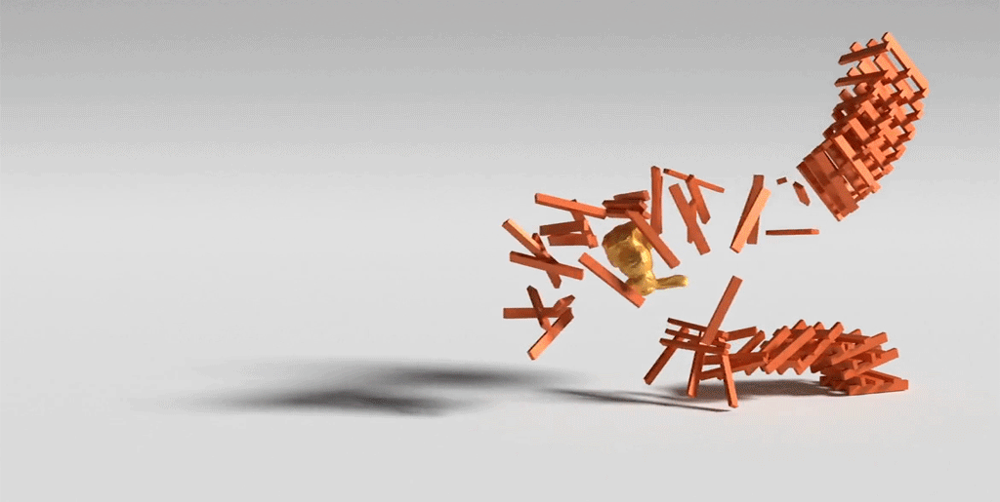
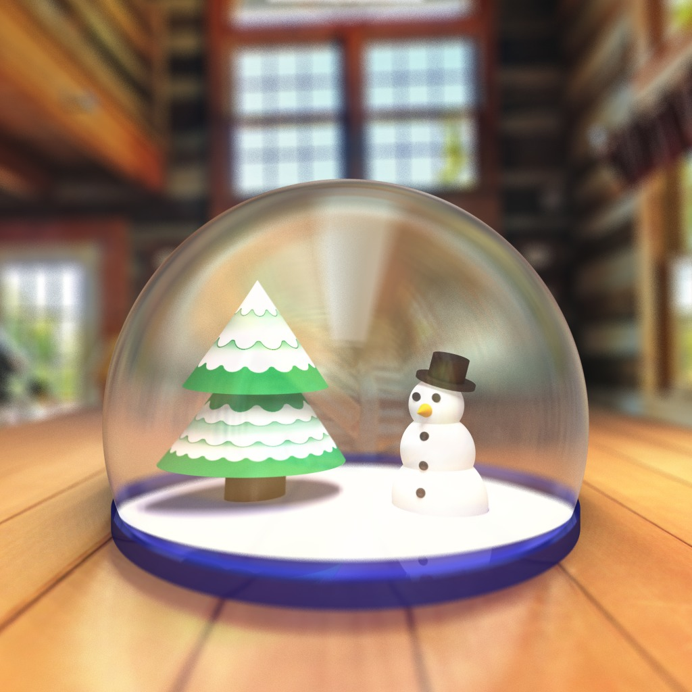

# Computer Graphics CSC317 _Winter 2022_   Course Syllabus

Tuesdays 15:00-17:00 in ~~BA 1170~~ Zoom (find link on quercus).  
Prof. [Alec Jacobson](http://www.cs.toronto.edu/~jacobson/)  
jacobson@cs.toronto.edu  
+1 416-946-8630  
Office hours Tuesdays 17:00-18:00 in ~~BA 5266~~ Zoom.  
Tutorials Thursdays 16:00-17:00 in ~~LM 161~~ Zoom/Discord.

Tuesdays 13:00-15:00 in ~~RW 117~~ Zoom (find link on quercus).  
Prof. [David I.W. Levin](http://142.93.146.228/researchdb/)
diwlevin@cs.toronto.edu      
Office hours Tuesdays 15:00-16:00 in ~~BA 5268~~ Zoom.  
Tutorials Thursdays 14:00-15:00 in ~~BA 1190~~ Zoom/Discord.

- [Course Overview](#courseoverview)
- [Required Textbook](#required-textbook)
- [Lecture Schedule](#lectureschedule)
- [Marking Scheme](#markingscheme)
- [Assignment Policies](#assignmentpolicies)

## Course Overview

This course introduces the basic concepts and algorithms of computer graphics.
It covers the basic methods needed to model and render 3D objects, including
much of the following: graphics displays, basic optics, affine and
perspective transformations, windows and viewports, visibility,
illumination and reflectance models, parametric representations, curves and surfaces, texture mapping, graphics
hardware, ray tracing, graphics toolkits, animation systems.

Through the weekly seminars at the [Toronto Geometry Colloquium](https://toronto-geometry-colloquium.github.io/), students will be exposed to a wide variety of cutting-edge research in an exciting subdiscipline of computer graphics: geometry processing. 

**Prerequisites:** C/C++ Programming, Linear Algebra, Calculus,([course
codes](https://fas.calendar.utoronto.ca/course/csc418h1)).

## Discord — Discussion Board

Please post your questions about the lectures, readings, and assignments on the
[Discord](https://discord.gg/GDeEqqBXMT). TAs will monitor
this board and attempt to answer questions as they appear. Near deadlines
responses may take longer, so please start assignments early. If your question
is not being answered, you may ask it again at the tutorial or office hours.

## Required Textbook

This class involves  **_required [reading](https://en.wikipedia.org/wiki/Reading)_** from:

[_Fundamentals of Computer Graphics, Fourth (or Fifth)
Edition_](https://www.cs.cornell.edu/~srm/fcg4/), Steve Marschner, Peter Shirley,
et al. 2015.

Digital e-book are available at [CRC
Press](https://www.routledge.com/Fundamentals-of-Computer-Graphics/Marschner-Shirley/p/book/9780367505035).

Students are expected to buy and read the specified chapters of this textbook.
Exams and assignments will depend not only material covered during lectures,
but also on material from the assigned readings.

## Marking Scheme

| % | Item |
| ----: | :-------------- |
| 5% | [Toronto Geometry Colloquium](https://toronto-geometry-colloquium.github.io/) Participation |
| 8% | Assignment 1 | 
| 8% | Assignment 2 | 
| 8% | Assignment 3 | 
| 8% | Assignment 4 | 
| 8% | Assignment 5 | 
| 8% | Assignment 6 | 
| 8% | Assignment 7 | 
| 8% | Assignment 8 | 
| 11% | Midterm exam |
| 20% | Final exam |

## Lecture Schedule

_Assignment dates still based on Fall offering. Will be updated soon._

| Week | Topic / Event |
| ---- | :------------ |
| 1    | Introduction, Demos of Solutions [Assignment 1 (Raster Images) due 12:00 noon 19/01](https://github.com/alecjacobson/computer-graphics-raster-images) (for students on the waitlist: zip your `src` directory and send to the TA email address (csc317tas@cs.toronto.edu) so that you get a timestamp)
| 2    | [Assignment 2 (Ray Casting) tenatively assigned](https://github.com/alecjacobson/computer-graphics-ray-casting)
| 3    | [Assignment 3 (Ray Tracing) tenatively assigned](https://github.com/alecjacobson/computer-graphics-ray-tracing)
| 4    | [Assignment 4 (Bounding Volume Hierarchy) tenatively assigned](https://github.com/alecjacobson/computer-graphics-bounding-volume-hierarchy) (**Note:** `./intersections` related portion only worth 10%)
| 5    | [Assignment 5 (Meshes) tenatively assigned](https://github.com/alecjacobson/computer-graphics-meshes) (**Note:** `./quad_subdivision` related portion only worth 10%) **_happy Thanksgiving_**
| 6    | _Work on Assignment 5_
| 7    | _Study for exam next week_.
| **Monday, October 28** | In-tutorial Exam (11% of grade)
| 8    | [Assignment 6 (Shader Pipeline) tenatively assigned](https://github.com/alecjacobson/computer-graphics-shader-pipeline)
| **Monday, November 4** | Drop date (consider if current grade is <50%)
| 9    | [Assignment 7 (Kinematics) tenatively assigned](https://github.com/alecjacobson/computer-graphics-kinematics) (**Note:** inverse kinematices `I,i` related portion only worth 10%)
| 10   | [Assignment 8 (Mass-Spring Systems) tenatively assigned](https://github.com/alecjacobson/computer-graphics-mass-spring-systems) <!-- Course Evaluations Nov. 20 - Dec 7 --> |
| 11   | The future of Computer Graphics
| 12   | _Study for exam next week_.
| Final | Final exam (20% of grade)

[Academic Honesty (required reading)](#academichonesty)

## Assignment Policies

Assignments must be submitted electronically, using [MarkUs](https://markus.teach.cs.toronto.edu/2022-01).

Code that you submit to us must work on the CS Teaching Lab machines in order to earn credit.

0.007% off for every minute late.

All assignments must be completed individually.

### Academic Honesty

Any code must belong to the student submitting it. Submitted assignments will
be automatically analyzed to identify suspicious levels of code similarity.
Consequences of committing an academic offence can be severe.

By enrolling in this course, students acknowledge that they have read and understand the University of Toronto's definitions and policy on Academic Integrity. 
